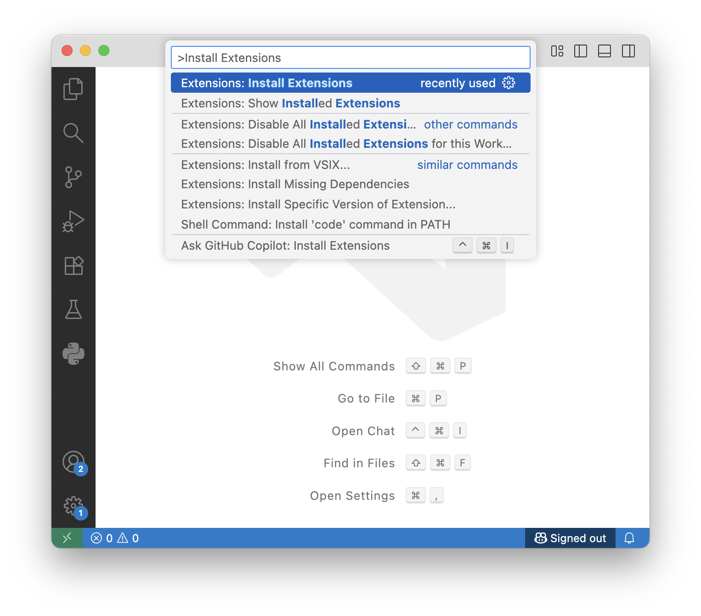
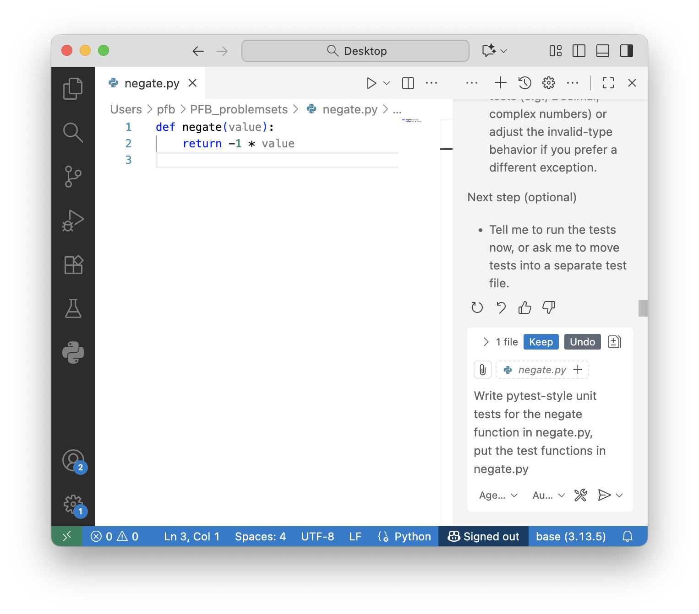

# Software Testing with `pytest` – A Bioinformatician’s Guide

## Introduction

If you've ever run a script to do some analysis and then wondered if the output is actually correct, this lecture is for you.

One of the most overlooked, but critical, parts of writing reliable software for biology and bioinformatics is software testing. 

**Why test your code?** Would you trust experimental results if the protocol wasn't validated? What about a protocol that doesn't yield repeatable results? Of course not. You’d expect controls, validation, and reproducibility. So, we should treat our data analysis scripts the same way. **Scripts are methods. Validate your methods**.

In bioinformatics, and software development in general, we write code to test code using known inputs and comparing to expected outputs. This typically takes the form of scripts (i.e., "test scripts") and functions (i.e., "test functions") that are written to perform tests on other script or module files — and the functions/classes they contain . More details about this are discussed below. Writing test scripts requires more up-front effort, but there are many advantages to writing them and test scripts save you much more effort in the long run.

Here are specific reasons to write test scripts to test your code:

1. **Catch bugs early, catch them fast**

   - Writing test scripts early in your software development cycle helps catch bugs early; tests should be run after each code change (=commit)!
   - The sooner you catch bugs, the easier they are to fix (especially in large, complex projects).
   - When you're still in the coding mindset, it's quicker to understand what went wrong and write fixes.
   
2. **Tests document expected behavior**

   - Tests serve as living documentation for your code. They show what inputs your code expects and what outputs it should return.
     
   
   - Future you (or collaborators or reviewers) can quickly understand what your code is supposed to do by examining how your code is used in tests.
   

3. **Code with confidence**
   - Want to optimize or change how your code works? Run your test suite. If all tests pass, your changes (likely) haven’t broken anything.
   - Even small changes can introduce bugs or cause other unexpected problems, running and passing tests reduces the chance of this.


4.  **Test scripts are better than manual guessing/checking**
    - Test scripts run tests more consistently, repeatably, and quickly than you can on your own.
    - Large, complex projects also tend to be complex to debug, test scripts help you narrow in on where the problem is.


5.  **Avoid incorrect conclusions**

    - In scientfic computing, your code needs to run correctly and produce the right answer. Kind of correct isn't good enough.
    -  Importanly, making decisions based on incorrect analysis wastes your time and resources.
    - Incorrect results can lead to publication retractions and damaged reputation.
    
    

###  Functional Testing

In biology and bioinformatics, we typically write software to perform a particular analysis and obtain interpertable results, such as summary statistics or a graphical plot. Because the software is the means-to-an-end and the results are that end, scientific software testing fits nicely into what is called the Functional Testing paradigm. 

**What is functional testing?** Functional testing means checking _what_ your software does, not _how_ it does it. It’s a black box approach: feed it input, check the output. *If the output is wrong, the code is wrong*. Because of nature of the paradigm, functional testing is blind to the details of the science motivating the code being tested. It's up to the programmer to ensure the high-level biological logic is accurate.

**Unit testing – zooming in.** Functional testing can be broad, but one of the most informative forms of functional testing for ensuring code accuracy is performed at the level of individual components; this is called *unit testing*. Unit tests are written to test some unit of code (functions, classes, or methods) in isolation using different inputs — or no inputs at all — and comparing their results to the expected outputs.     To the extent that software is the sum of its parts, testing the individual units of your code simplifies the procedure of code validation into many, smaller and more-easily testable parts; the tests are easier to write and the outputs are less complex. Once you know your unit (function, class, etc.) works, you can more confidently incorporate it into a bigger script.

There are a variety of software available to perform unit testing in Python, the most popular are the `unittest` module and the `pytest` test suite. Below, we will use `pytest` to demonstrate how to write unit tests because of its ease of use and minimal programming overhead.


##  Functional testing using `pytest`

[`pytest`](https://docs.pytest.org/en/stable/index.html) is a lightweight, yet powerful, Python testing framework that:

- Allows you to write simple, readable test functions.

- Automatically looks for test functions and scripts that start with `test_` 

- Runs tests and reports which pass or fail.

- Works great for unit tests and even larger system-level tests.

All you need to do is:

- Install it with e.g.`micromamba install pytest`

- Write scripts or functions that start with `test_`. For example, the file `test_myscript.py`, might contain a series of tests that verify `mysscript.py` works correctly. Or, you might write a function like this:
	```python
	def test_negate():
	    # test code
	```
	
- Use `assert` statements inside the test function to verify the output is what you expect. *Any* exception raised will trigger a test failure, but `assert` is useful for raising an exception when the condition evaluated (e.g., our observed value matches the expected value) is `False`. An assertion failure message can be included for when an exception is raised: 

  ```python
  assert condition, 'failure message'
  ```

  Simple examples of how to use `assert` can be seen below.


### Writing tests with `pytest`: step by step

Let's work with this function that inputs a number and negates it, turning positive values negative and vice versa. We will write some unit tests to validate this function for a variety of common use-cases.

```python
def negate(value):
    return -1 * value
```


#### Testing basic behavior

Basic first question: does our function work with the expected input types (`negate` performs a numeric operation, so does it work with simple numeric inputs)? 

```python
def test_negate_negative():  
    expected = 8
    observed = negate(-8)  # here's where you call the actual function you 
                           # being tested
    assert observed == expected, f'expected positive output ({expected}), got ({observed})'
```

**Explanation:**

- The function `test_negate_negative` checks what happens when `negate` is called with a negative value.
  - The `test_` prefix tells `pytest` this is a test function.

  - The rest of the function name is arbitrary and is just a label to help the user know which function is being tested. In this example, `negate_negative` hints that it tests negative input for a negation function. The test function name doesn't inform `pytest` which function is being tested. The function being tested must be called in the test function.

- The return value of `negate(-8)` is stored in the `observed` variable.

- `assert` checks whether the `observed` result is 8 as expected.

- If it's not,  `assert` raises an `AssertionError` exception, triggering a test failure with the `assert` message shown in the failure report.

- This confirms the core functionality of the `negate` function with negative inputs.


```python
def test_negate_positive():
    expected = -8
    observed = negate(8)
    assert observed == expected, f'expected negative output ({expected}), got ({observed})'
```

**Explanation:**

- Similar logic: we expect `negate(8)` to return -8.

- This confirms the core functionality of the `negate` function with positive inputs.


> What is the function being tested in the following test function?

```python
def test_another_great_test_with_zero():  
    expected = 0
    observed = negate(-0)
    assert observed == expected, f'expected positive output ({expected}), got ({observed})'
```

**Explanation:**

- The name of the `test_` function is arbitrary, but good test function names are descriptive.

  

#### Exception handling tests

We also want to make sure the function has sensible behavior when used incorrectly. Because the definition of the `negate` function requires an input value, calling `negate()` (without an input argument) raises a `TypeError`:

```python
>>> def negate(value):
...     return -1 * value
...     
>>> negate()
Traceback (most recent call last):
  File "<python-input-2>", line 1, in <module>
    negate()
    ~~~~~~^^
TypeError: negate() missing 1 required positional argument: 'value'
```

So we write a test to ensure the function produces an error when called without an argument:

```python
def test_negate_noarg():
    try:
        observed = negate()  # raises a TypeError
    except TypeError:        # catches the TypeError, which is the correct behavior
        return               # return means we passed the test
    assert False, 'expected TypeError exception, got ({observed})'
```

**Explanation:**

- Here, we're testing that calling `negate()` with no arguments raises a `TypeError`.

- If the exception is raised, the test passes silently (`return` exits the test).

- If no exception is raised, the last line is evaluated: `assert False` fails the test on purpose.


### When simple test design doesn't work


```python
def test_negate_nan():
    try:
        observed = negate('this-is-not-a-number')  # oddly, -1 * str returns an empty 
                                                   # string and a TypeError is *not*
                                                   # raised
    except TypeError:
        return
    assert False, 'expected TypeError exception, got ({observed})'
```

**Explanation:**

- Same idea as above: we pass a string value that cannot be converted to a number.

- We expect a `TypeError` to be raised, but it isn't. Python returns an empty string without an error, but this is incorrect behavior for numeric negation. 

- Because the `TypeError` is not raised, it is not caught by the `except TypeError` condition. The test then evaluates the `assert False, ...` line, and the test fails. 

  

Our original function failed the test, so we must fix the function definition to catch non-numeric inputs. Here's a new function definition:

```python
def negate(value):
	  try:
        float(value)
    except ValueError:
        raise TypeError(f"invalid input type {type(value)}")
    return -1 * value 
```

Now, when we re-run the test, it passes:

```python
def test_negate_nan():
    try:
        observed = negate('this-is-not-a-number')  # now raises TypeError
    except TypeError:  # TypeError is caught
        return         # and we return, passing the test
    assert False, 'expected TypeError exception, got ({observed})'
```

**Explanation:**

- We modified our `negate` function to `try` casting input values to `float` to check if they resemble a numeric value (e.g. `float('1.0')` converts the string value `'1.0'` to a floating point `1.0`, but cannot convert `e346` to `float`)
- If `float(value)` cannot convert an input to a floating-point value, it raises a `ValueError`, catch it and instead raise a `TypeError`, because the user gave us a variable of bad *type*.
- Our modified `negate` function now passes the `test_negate_nan` test function.


#### Parametrized testing (testing a range of values)

Instead of writing dozens of similar tests by hand, we can iterate our test over many inputs. The following requires importing `pytest` as a module to use the `@pytest.mark.parametrize` decorator function (which is just a wrapper function around the function being decorated).

```python
import pytest

@pytest.mark.parametrize("i", range(50))
def test_negate_positive_range(i):
    expected = -1 * i
    observed = negate(i)
    assert observed == expected, 'expected negative output ({expected}), got ({observed})'
```

**Explanation:**

- The `@pytest.mark.parametrize("i", range(50))` decorator tells `pytest` to run this test 50 times.

- Each time, `i` will take a value from 0 to 49.

- For each value, it checks that `negate(i)` is the negative of `i`.

- This is a concise way to check many inputs without duplicating test code.


```python
@pytest.mark.parametrize("i", range(50))
def test_negate_negative_range(i):
    expected = i
    observed = negate(-1 * i)
    assert observed == expected, 'expected positive output ({expected}), got ({observed})'
```

**Explanation:**

- Same as before, but this time we check that negative inputs are negated to positive values.

- Together, these two tests cover the whole behavior range of `negate()` for typical numeric inputs.


#### Capturing standard outputs (e.g., `print()`)

Sometimes your functions will print output and you want to test what was printed. This is useful when testing command-line tools, logging, or user messages.

```python
def info(message):
    print(f'[INFO] {message}')
    
def test_stdout(capsys):
    info("hello")
    captured = capsys.readouterr()  # .readouterr() from pytest
    assert captured.out == "[INFO] hello\n"
    assert captured.err == ''
```

 **Explanation:**

- `capsys` is a special `pytest` fixture that captures stdout and stderr.
- `info("hello")` is the function being tested, and it just prints text to stdout.
- `captured = capsys.readouterr()` grabs whatever was printed to stdout and stderr.
- `captured.out` contains `"[INFO] hello\n"`. Mind the trailing newline (`\n`).
- `captured.err` contains error output — here we check it's empty (as we haven't printed anything to stderr).


#### Caveat: comparing floating-point values

Because computers represent all characters as binary arrays of 0s and 1s (a base-2 system), floating-point number representation (in base-10 system) and calculations can be imprecise. Consider the following case:

```python
>>> 0.3
0.3

>>> 0.1 + 0.2
0.30000000000000004

>>> (0.1 + 0.2) == 0.3
False
```

Therefore, when handling floating-point values, it is unsafe to check that two floating point values are exactly equal. Instead, we must ask whether they are *approximately equal* to within some tolerance:

```python
# pytest provides an approx() function:
>>> import pytest
>>> pytest.approx(0.1 + 0.2, rel=1e-6) == 0.3
True
```


#### Running tests with `pytest`  commandline tool

For simple scripts, it's most convenient to write your test functions in the same script file as the functions being tested. Then, you can run `pytest` directly on your main script and `pytest` will automatically detect which functions are test functions and run only them.

```bash
$ pytest ./myscript.py
```

For larger coding projects (involving multiple module files, etc.), it's better to write your test functions in separate, dedicated `test_*.py` scripts. Various `pytest` invocations are possible:

```python
# Point pytest directly to a test script file 
# separate from your main script:
$ pytest ./test_myscript.py

# Point pytest at a specific test/ directory 
# containing potentially many test_*.py files:
$ pytest test/

# Recursively search for test_*.py files in the
# test directory, then run pytest on all those 
# that were found:
$ pytest
```


By default, `pytest` will print a `.` for every test performed that `PASSED`, an `s` for `SKIPPED` tests, and `F` for `FAILED` tests:

```bash
$ pytest ./myscript.py
======================== test session starts =========================
platform darwin -- Python 3.14.0, pytest-8.4.2, pluggy-1.6.0
rootdir: /Users/pfb
collected 105 items                                                  

myscript.py ...F.............................................. [ 47%]
.......................................................        [100%]

============================== FAILURES ==============================
__________________________ test_negate_failure __________________________

    def test_negate_failure():
>       assert False, 'message describing expected type, observed type'
E       AssertionError: message describing expected type, observed type
E       assert False

myscript.py:41: AssertionError
====================== short test summary info =======================
FAILED myscript.py::test_negate_failure - AssertionError: message describing expected type, observed type
=================== 1 failed, 104 passed in 0.22s ====================
```

Adding the `-v` flag to the `pytest` command will write a more verbose output to screen, listing each test and whether it `PASSED`, `SKIPPED`, or `FAILED`, which can be more intelligible when there are many failures:

```bash
$ pytest ./myscript.py -v
======================== test session starts =========================
platform darwin -- Python 3.14.0, pytest-8.4.2, pluggy-1.6.0 -- /Users/pfb/.mamba/envs/pytest/bin/python3.14
cachedir: .pytest_cache
rootdir: /Users/pfb
collected 105 items                                                  

myscript.py::test_negate_negative PASSED                          [  0%]
myscript.py::test_negate_positive PASSED                          [  1%]
myscript.py::test_negate_noarg PASSED                             [  2%]
myscript.py::test_negate_failure FAILED                           [  3%]
myscript.py::test_negate_positive_range[0] PASSED                 [  4%]
myscript.py::test_negate_positive_range[1] PASSED                 [  5%]
...
myscript.py::test_negate_negative_range[48] PASSED                [ 98%]
myscript.py::test_negate_negative_range[49] PASSED                [ 99%]
myscript.py::test_output PASSED                                [100%]

============================== FAILURES ==============================
__________________________ test_negate_failure __________________________

    def test_negate_failure():
>       assert False, 'message describing expected type, observed type'
E       AssertionError: message describing expected type, observed type
E       assert False

myscript.py:41: AssertionError
====================== short test summary info =======================
FAILED myscript.py::test_negate_failure - AssertionError: message describing expected type, observed type
=================== 1 failed, 104 passed in 0.23s ====================
```


## How To Write Good Tests

### 1. Use meaningful test names

- Meaningful test names give you a better idea of what went wrong. For example, `test_negate_negative()` is much clearer than `test1()`, and suggests negating negative values doesn't work as expected.

### 2. Make tests small and specific

- Set up one condition per test. A greater number of fine-grained tests helps pinpoint exactly what’s broken.
- Create **small**, but realistic datasets (e.g. short FASTA files) and compute expected output(s) by hand or by using a trusted tool. 

### 3. Think defensively

When writing tests, ask yourself:

- What if the user gives your function the wrong input *value*?
- What if the user gives your function the wrong input *type*?
- What if the user gives your function *no* input(s)? Is it safer for your code to raise an exception or return a reasonable default (e.g., see `int()`, `float`, and `str()`)?

### 4. Cover edge cases

- Good tests aren’t just about the easy or obvious options, they should push the envelope to catch unexpected behavior.
- If a bug is found, write test cases for it *prior* to writing a fix. Afterwards, write your bug fix and run the tests; this ensures your changes actually fix the original issue.

### 5. Report *why* the failure occurred

-  Good tests include failure messages that report expected input(s)/output(s) and those given/received. This gives you better hints for why your code failed and how to fix it.

## Getting help writing tests with GitHub Copilot

Writing a complete set of useful tests takes thinking power and writing a few dozen functions. This quickly gets repetitive, requires a lot of attention to detail, and can seem like a daunting task. An AI extension called Copilot can be installed in VS Code and it helps with simple coding. A good use of this tool is to write test function code based on a prompt you provide that carefully and completely describes the test you want to add.

Let's see how to install Copilot.

### Installing the GitHub Copilot VSCode extension

1. To install the GitHub Copilot extension in VSCode, press `command`+`shift`+`P` to open the command palette. Then type "Install Extensions" and press ` return`.
   

2. In the left-side "Extensions: Marketplace" search bar, search "Copilot": 
   

3. Click the blue `Install` button next to either of the "GitHub Copilot" extensions (installing one installs both). Copilot's walk-through checklist may appear in the main panel. Click the "Mark Done" text on the bottom left to proceed.
   

4. A Copilot Chat panel should now be open on the right-hand side. If it is not, you can open it by pressing `command`+`shift`+`I`. 


### Writing tests with GitHub Copilot

As we've already noted, carefully designing and writing all these test functions is a lot of work, but there is a good way to automate the most repetitive parts of the task. If you're using GitHub Copilot (in VSCode or other IDEs):

- As you write your script functions, you should prompt Copilot to write test functions for them.

- These must include what happens if input is `None`, or the wrong type/value, or has typos.

- They can help speed up test-writing, but:
  - Copilot doesn’t understand your function's intent and may write bad tests.
  - You must **review tests carefully** before trusting the test logic.

- You can write better tests in Copilot using the following tips:

  - Start your Copilot Chat prompt with "*Write pytest-style unit tests for X function in myscript.py...*"

  - By default Copilot with put test functions in a separate test script. To include them in the same script containing the functions being tested, you have to tell Copilot explicitly (e.g., "*... put the test functions in myscript.py...*")

  - Write doc strings for each function. This not only provides human users more context about how your function(s) work, it helps Copilot as well. Describe:

    - input arguments and their expected type(s)
    - output data type(s) returned
    - any exceptions raised and in what conditions
    - Include typical usecases as examples; Copilot will often include them as unit tests.

    ```python
    def negate(value):
        """Negate numeric values
        Args: value: int, float, complex, or a string resembling such types
        Returns: negated value of int, float, or complex type
        Raises: TypeError if value cannot be interpreted as a numeric type
        
        Examples:
        >>> negate(-1)      # returns 1
        >>> negate('3.14')  # return -3.14
        >>> negate('foo')   # raises TypeError exception
        """
    ```


## Problem set

Generally, you will write your test functions in the same script file as the functions being tested and run `pytest` on your scripts to run the tests.

1. Using the following simple function:

    ```python
    def gc_content(seq):
        valid = {'A', 'C', 'G', 'T'}
        if not set(seq).issubset(valid):
            raise ValueError("Invalid characters in sequence")
        if len(seq) == 0:
            return 0
        return (seq.count('G') + seq.count('C')) / len(seq)
    ```
    Write `pytest` unit tests for this function that:  
    - confirm GC content of `"GCGC"` is `1.0`.  
    - confirm GC content of `"ATAT"` is `0.0`.  
    - confirm GC content of `"ATGC"` gives `0.5`.  
    - confirm that empty string returns `0`.  
    - confirm that `"ATGXB"` raises a `ValueError`. 

2. Modify your script to add tests of the `gc_content` function for the following inputs (below). Re-run `pytest` on your updated script. Do these new tests pass or fail? Are the inputs below reasonable inputs? Afterward, modify the `gc_content` function so that `pytest` passes all tests. Confirm your modified `gc_content` function can:

    - Calculate the GC content of `"ATGNNNTAGC"` as `0.3`.
    - Calculate the GC content of the lower-cased sequence `"gattacaa"` as `0.25`. 

3. Write a function to reverse complement a DNA sequence, then write unit tests for it that:

    - Confirms an all-lower-case input sequence is correctly reverse-complemented. 

    - Confirms an all-upper-case input sequence is correctly reverse-complemented.

    - Confirms a mixed-case input sequence is correctly reverse-complemented.

    - Confirms an input sequence containing non-`ATCGN` characters triggers an exception.

4. Write a function that determines whether an input value is a number and outputs a boolean (`True`/`False`) value, then write unit tests for it that:

    - confirms the number `1.3` returns `True`.

    - confirms the string `'0'` returns `True`.

    - confirms the string `'1e-3'` returns `True`.

    - confirms the string `'1.5+2j'` (a complex number) returns `True`.

    - confirms the string `'not-a-number'` returns `False`.

5. Using an AI (such as Github Copilot, ChatGPT, etc.), write unit tests for the DNA sequence class you wrote for the Python 11 problem set. Write your test functions in a separate `test_` script that imports your sequence class and performs tests on its methods.

    - Look carefully at all the unit test inputs and expected outputs. Are they correct?

    - Now, we will have AI write more tests for a new method you will add to your DNA sequence class. 

      1. Copy the following method stub (which contains the `def` line and a doc string, but no executable code block) into your code. 

          ```python
          def six_frames_nt(self):
              """Outputs all six reading frames (3 forward, 3 reverse complement) as nucleotide seqences. 
              Arguments: None
              Returns: list of six strings, each string is a reading frame (forward 0, 1, 2; reverse 0, 1, 2).
          
              Examples:
              >>> sixframes_nt = Sequence("id1", "ATGCGTTAG").six_frames_nt()
              """
          ```

      2. Ask AI to write your tests. 
      3. Look carefully at the tests it produced. Are they correct (correct frames, length divisible by three, reverse-strand sequence is correctly reverse complemented, etc.)?
      4. Next, write the code to extract the six reading frames as a list of sequence strings (as described in the stub above). Test your code by running `pytest` on your test class methods.
    
    - Lastly, do the same for a new method called `six_frames_aa` that outputs all six reading frames as a list of six amino acid sequences: 
    
      1. Write a method stub (include a description of what the method does, input arguments, returned values, and examples).
      2. Ask AI to write your tests.
      3. Check the correctness of the tests(!).
      4. *Then* write the method code. Run `pytest` on your test script to test your class methods. 
