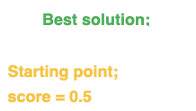

# Project Proposals

# transcriptomes: WCGNA

# TAs: Riley, Bekah

**Description of the Problem:**

In transcriptomic data, changes in one gene’s expression may lead to coordinated shifts in others. However, exploring these correlations manually is time-consuming and not easily scalable across multiple datasets. This project aims to build a tool that identifies and visualizes gene–gene expression correlations between two biological groups (e.g., diseased vs. normal samples).

**Proposed Programming Solution**

- **Data processing:** Implement code to import two gene expression matrices, align shared genes, and normalize expression values.
- **Correlation analysis:** Compute pairwise correlation coefficients (Pearson or Spearman) for each gene across samples within each group.
- **Interactive query:** Allow the user to input one gene of interest and retrieve all genes significantly correlated with it in either group.
- **Visualization:** Generate heatmaps and correlation networks highlighting the strength and direction of correlations.

**Overview of Implementation**

- **Stages/components:** (1) Data input & preprocessing, (2) Correlation computation, (3) Statistical filtering, (4) Visualization, (5) Optional user interface (command line or simple web app).
- **How code solves the problem:** Automates identification of co-expressed gene sets
- **Desired inputs:** Two gene expression tables (CSV or TSV) with genes as rows and samples as columns.
- **Desired outputs:** Correlation matrix files, ranked lists of correlated genes, and visual outputs (heatmaps, scatterplots, or network diagrams).
- **Potential challenges:** Handling missing data, large-scale computation efficiency, and false-positive correlations due to sample size.
- **Anticipated programming concepts:**
  - **Logic & control flow:** Conditional statements and loops for iterative correlation testing.
  - **Data structures:** Data frames, dictionaries, and matrices for organizing expression data.
  - **Modules:** Use of `pandas`/`numpy` (Python) or `tidyverse` (R) for data manipulation and `matplotlib`/`ggplot2`for visualization.
  - **Algorithms:** Implementation of correlation and multiple-testing correction algorithms (e.g., Bonferroni or FDR).

#  In-Silico Southern Blotting Analysis Tool //RE GAME

# TA: Eric

**Problem:** 
Southern blotting, used for detecting specific DNA sequences, is experimentally complex and error-prone due to issues like poor probe specificity, incorrect hybridization temperatures, and suboptimal gel electrophoresis conditions. An in-silico tool that predicts restriction fragment patterns, electrophoretic parameters, and probe hybridization properties could streamline experimental design and reduce errors. 

**Proposed Solution:** 

- **Parse genome FASTA files** and identify restriction enzyme sites via sequence pattern matching. 

- **Generate restriction fragment lists**. 

- **Optimize electrophoresis conditions** by calculating gel concentration based on fragment size range goal. 

- **Analyze probe sequences** by locating exact or near matches in the fragmented genome, reporting coordinates and percent identity. 

- **Estimate hybridization temperatures** based on probe nucleotide composition. 

- **Bonus: suggest probe length adjustments** for improved specificity and hybridization efficiency. 

**Inputs:** 

- Genome/DNA sequence in FASTA format 

- Restriction enzyme recognition sequences 

- Fragment length range and resolution parameters 

- Probe sequences for hybridization analysis 

**Outputs:** 

- Table of probe matches with chromosome coordinates and percent identity 

- Calculated hybridization temperature for probes 

- Recommended gel concentration for electrophoresis 

**Challenges:** 

- Accurate prediction of gel electrophoresis and hybridization temperature 

- Designing algorithms tolerant to sequence mismatches for probe specificity 

**Key Programming Concepts:** 

- Efficient FASTA parsing and sequence pattern matching 

- Data structures (lists, dictionaries, tuples) for storing and sorting fragments/matches 

- Sequence alignment for probe matching and identity calculation 

- User interaction through input prompts and tabular output 

 

# Multiple sequence primer design tool 

# TA: Jessen

Objective

The objective of this project is to design primer pairs that specifically includes or excludes mismatches across a group of sequences, e.g. (same gene different species, same gene, different isoforms, different genes in the same family). An example where we need to distinguish between different species in the same sample – where human pluripotent genes to induce pluripotent cells in species X, humanized models. On the other hand, we may want to capture all members of a gene family, all gene isoforms, or all copies of a gene. 

This Python tool would allow users to systematically parse through sequences to generate primer pairs that includes or excludes mismatches in a group of sequences.

Method

Test data set

Goal: Design primer pairs to detect all amylase copies in the Mexican cavefish species, Astyanax mexicanus.

Similar tools

PrimeSpecPCR: Python toolkit for species-specific DNA primer design and specificity testing

IsoPrimer: a pipeline for designing isoform-aware primer pairs for comprehensive gene expression quantification

I was also thinking about how to extract exon information on the mRNA FASTA sequence, and that would be a way to prioritize primers (exon-exon junction), but I don't know if that would be too complex.

1. 

# immunology game

# TA: Colin

*Description*: The interplay between the host immune system and an invading pathogen involves many complex processes and interactions. Gamifying these concepts makes learning about concepts of immunology and microbiology entertaining and approachable, and the “arms race” that occurs between an invading pathogen and the host immune system naturally lend themselves towards a two-player battle-style game. This project would require the joint efforts of immunology and microbiology content experts to make a fun and educational game!

*Proposed programming solution:*

- Pygame is a free and open-source library that can be used for the development of video games using Python, allowing for a visual and interactive way to strengthen beginner programming knowledge
- Game ideas:
  - Each player will choose to play as the “immune system” or the “pathogen”
  - Each side will have specific types of “attacks” or “defenses” they may choose to employ
    - Some examples/ideas:
      - The immune system may start with only the use of “innate immune system” methods for the first few rounds of attack (i.e. recruiting phagocytes, complement activation)
      - After several rounds, “adaptive immune system” methods can be used (i.e. antibody-mediated response, etc.)
      - Pathogens will have their own set of methods available (i.e. different virulence factors) and those can also change over time/rounds (i.e. development of multi-drug resistance)
      - Potential expansion to the ability to select the type of pathogen and include cancerous cells as an enemy type to the immune system

*Anticipated programming concepts*:

- The creation of “character” types in the form of immune cell and microbe types will involve class creation and defining methods for these classes
- Importing images/graphics will rely upon the usage for file I/O
- The repetitive structure of a “battle” type game will require the use of event loops and nested logic 
- The visual nature of a game will allow for immediate, visual feedback during the de-bugging process that makes it easier and clearer to see the impact of the modifications we make to our code

# VMH Metabolite Cross-Reference Extractor: Building a Comprehensive Cross-Database Metabolite Map

# TA: Ken

**Description of problem:** The Virtual Metabolic Human (VMH) database is a comprehensive repository integrating human metabolic reactions, enzymes, and metabolites derived from the Recon3D genome-scale metabolic atlas. While VMH provides detailed biochemical and cross-database information (e.g., KEGG, ChEBI, PubChem, HMDB), accessing this information typically requires manual searching through the website interface. Although the VMH API allows programmatic access, it currently supports retrieving metabolite information only one entry at a time, making large-scale data extraction inefficient. This project aims to develop a Python-based tool to automatically iterate through the VMH database and retrieve all metabolites along with their associated external database links, creating a unified cross-referenced metabolite map. 

**Proposed programming solution:** 

**Overview of features/stages/components to be implemented:** The script will connect to the VMH database and automatically iterate through all metabolite entries. For each metabolite, it will extract key information and all associated external database links (e.g., KEGG, ChEBI, PubChem, HMDB). The final step will compile all data into a structured file summarizing every metabolite and its cross-references.

**How the proposed code solves the problem:** It eliminates the need for manual retrieval of metabolite information from the VMH website. By collecting all external database identifiers, it creates a unified dataset that can be used directly for metabolic modeling.

**Desired inputs:** The script directly queries the publicly available VMH to retrieve metabolite information.

**Desired outputs**: The program will generate a file containing all metabolite entries and their cross-database identifiers. Moreover, it will display summary statistics and visualizing database coverage.

**Potential challenges:** The main challenge lies in handling the sensitivity of metabolite names and IDs, which often vary across databases and may include inconsistent formats or capitalization. This could lead to mismatches during automated extraction and mapping. Additionally, accessing extended information from VMH and related databases may be difficult, as certain details are embedded within interactive web elements or tabs that redirect to external links rather than being available through direct API calls. Designing the script to navigate or bypass such interactive structures while maintaining accuracy and completeness will be a critical implementation challenge 

# Can you reach the peak??

# TA: Josh

**Problem:** I’m interested in molecular evolution and fitness landscapes. For example, during systematic evolution by exponential enrichment (SELEX), from round to round, certain sequences mutate so that they get closer to the desired maximum, and some move further away from the desired maximum fitness. Some sequences could end up in minima or a non-global maximum. If one had all the sequences from every round of SELEX, one could start to map out how the evolutionary process traverses the fitness landscape for that sample population and fitness criteria.

**Proposed Project:** Create a game that maps out simple fitness landscapes. Imagine that there is a landscape – which the player cannot see (shown in grey in the figure below).

 

The player is given a starting sequence, for example AANDV (yellow dot). They can then mutate that sequence which will result in either the score increasing or decreasing. The player might try AANDA and get a score of 0.6. They might then try SANDA and get a score of 0.3. An attempt of TANDA gets a score of 0.8. All these attempts would be mapped onto the landscape as the player continues. 

Perhaps the player has a certain number of attempts – and they can see how close they can get before they are out of attempts. This is a bit like Hangman and a bit of a guessing game - although the scores would be based on a similarity matrix, so knowledge about the behavior of amino acids would be useful. The output, regardless of whether the player “wins” or not, would be a partial map of a landscape.

**Proposed programming solution**: Convert a given sequence to a score and calculate the difference between that score and the original score (the best score will always be normalized to 1). A scoring matrix (like the ones covered by Bill Peterson) can be used to take an input peptide sequence and create a score. This would most likely involve the use of data structures. The script would then calculate the change between this score and the starting score. There are additional outputs such as plotting this change on a 2D graph that I haven’t figured out yet – but I bet we can figure it out! There are also things that could be added to make this function like a game (perhaps with tokens involved – one token per attempt, countdowns, and/or visuals).

cradle bio elise de reus post

 

